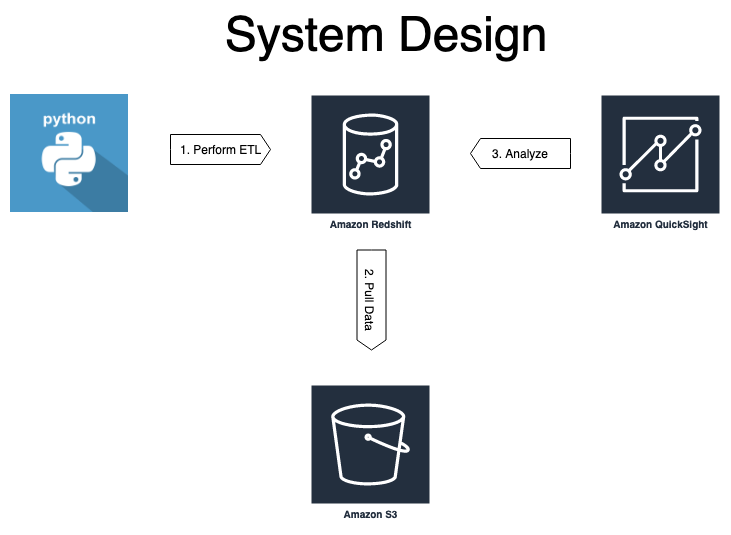
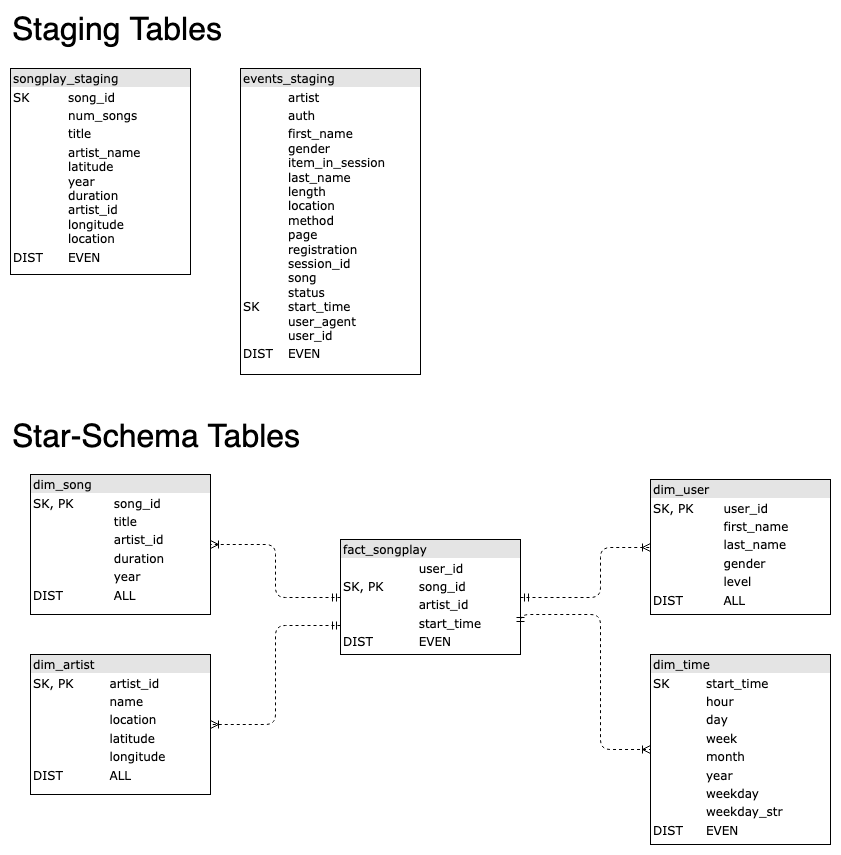
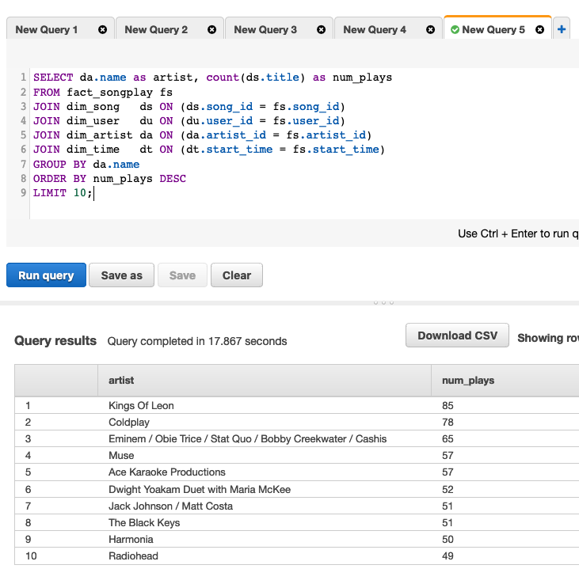

# AWS Redshift Data Warehouse

How can you build a simple data pipeline on AWS to support your analytical users?  In this repository, I will show how using [AWS S3](https://docs.aws.amazon.com/AmazonS3/latest/dev/Introduction.html) for storage, [AWS Redshift](https://docs.aws.amazon.com/redshift/latest/mgmt/welcome.html) to perform ETL and Python to orcestrate it.  First, the data are extracted from JSON log files stored on S3 the SQL using Redshift's `copy` command that creates the staging tables.  Next, SQL `insert` statements transform the data.  Finally, I show you how to use the star-schema for analysis. 



## Files

1. `create_tables.py` - Uses `sql_queries.py` and `utils.py` to drop (delete) and create all tables.  After running this module the database is ready for data to be imported.
 
1. `sql_queries.py` - Creates, inserts and drops all staging and star schema tables.  Show how to analyzes the data in the star-schema.  

1. `utils.py` - Creates connections to a running AWS Redshift instance.  Uses data stored in `dwh.cfg`.

1. `events_log_jsonpath.json` - Maps data elements from the events log file into the events_staging table.  More broadly, the jsonpaths file allows any hierarchical JSON data to be mapped into a flat SQL table.  The field names are from the JSON file.  Ordering determines which column they are insterted into the table.  The JSON field listed in the first row in the jsonpaths file is inserted into the first column of the SQL table.

1. `songplay_log_jsonpath.json` - Maps user's song play activity into the songplay_staging table.  Plays the same role as is described above for the events log data.  

## Table Design

Staging tables support data ingest from online transaction processing systems (OLTP).  Here data are extracted from JSON files and inserted into the staging tables using the `copy` command provided by AWS Redshift.  More on that later.  Star-schemas are great for supporting analytic workflows utilized by online analytic processing systems (OLAP).  

Derived from the code of the open source PostgreSQL project, Redshift distributes tables allowing for it to operate on the parallel in parallel.  The distribution style (diststyle  or distkey) can be configured as:

* even - spreading data evenly among nodes
* all - an entire copy of the table on every node
* auto - optimized by Redshift
* key - stores data with common key values on a node

Additionally, a sortkey can be provided too that orders the data on each node according the key assigned.  In Redshift, primary and foreign keys are treated as suggestions to the query processing runtime. 



## Running

1. Assumptions:  You have a S3 bucket with data you want to parse and Redshift cluster up and running.  Plus, you have `dwh.cfg` file containing the following fields:

```
[CLUSTER]
DB_ENDPOINT=an-endpoint-address-available-on-the-cluster-status-page
DB_NAME=your-db-name
DB_USER=your-db-user
DB_PASSWORD=your-db-users-pw
DB_PORT=5439
CLUSTER_TYPE=multi-node
NUM_NODES=4
NODE_TYPE=dc2.large
AWS_REGION=same-region-as-your-s3-data
CLUSTER_ID=your-clusters-name

[IAM_ROLE]
ROLE=an-iam-role-with-redshift-full-access-ands3-read-only-access
DWH_ROLE_ARN=the-arn-of-this-role

[S3]
LOG_DATA=s3://udacity-dend/log-data
LOG_JSONPATH=s3://udacity-dend/log_json_path.json
SONG_DATA=s3://udacity-dend/song-data
```

Okay, this step was a heavy lift, especially the first time!

1. Run `python create_tables.py` dropping (deleting) all your exiting tables and re-creating them.  These commands run quickly.

1. Run `python etl.py1` and type `L` to extract the data from the log files and insert them into the staging tables.  _This command took me more than 1 hour to run with four dc2.large nodes in my cluster._  The bulk of that time is spent copying the songplay data logs.

1. Run `python etl.py` and type `I` to transform and load the data from the staging tables into the star-schema tables.  This command only took only a few minutes to run on my cluster.

1. Run analytics queries using the Redshift console or [other means](https://docs.aws.amazon.com/redshift/latest/mgmt/connecting-using-workbench.html).


## Loading data on AWS Redshift -- A JSON example

Load data from S3 using Redshift's `copy` command of JSON data.  Let me point out a couple of arguments that I found particularly important.

* truncatecolumns - Shortens strings so that they fit into the size of the field in the table.  Varchar fields default to 256 bytes -- not characters -- in Redshift.

* epochmillisecs - Parsing time values expressed as UNIX epoch time in milliseconds.

* maxerror - Number or errors allowed before your copy job is cancelled.  Runtimes for copying the ~385,000 JSON files exceeded an hour with a 4 node cluster.

* compupdate - Here I turn off compression with the hope of improving runtimes.  This did _not_ seem to have a big effect. 

```bash
COPY event_staging FROM 's3://udacity-dend/log-data/2018/11/2018-11-11-events.json'
IAM_ROLE 'a-redshift-role-arn'
JSON 's3://dend-util/events_log_jsonpath.json' truncatecolumns
TIMEFORMAT 'epochmillisecs'
REGION 'us-west-2';
COMPUPDATE off
MAXERROR 3;
```

Unless you want a one-to-one mapping of your JSON data into your table, you will need to map columns between the two representations.  My JSON data was flat to begin with, so here I am just picking and choosing which columns to take.  The names in the jsonpaths file must match the SQL table and their order must match that of the JSON file.  This example is based on the event logs of user activity.  

```json
{
    "jsonpaths": [
        "$['artist']",
        "$['auth']",
        "$['firstName']",
        "$['gender']",
        "$['itemInSession']",
        "$['lastName']",
        "$['length']",
        "$['level']",
        "$['location']",
        "$['method']",
        "$['page']",
        "$['registration']",
        "$['sessionId']",
        "$['status']",
        "$['ts']",
        "$['userAgent']"
    ]
}
```

## Creating a table

Create the Redshift table using SQL using revised column names.  JSON data elements are extracted based on the name given in the jsonpaths file and inserted into the table based on the order they are defined jsonpaths file.  The order of the data elements in the jsonpaths file must match that of the SQL table.  For example, `itemInSession` is inserted into the 5th column of the SQL table.  In the process the name is effectively changed from `itemInSession` to `item_in_session`.  This name translation only occurs because I am using a jsonpaths files that maps the values between representations.  

The `DISTSTYLE` determines how the data are distributed across the cluster's nodes.  Thier order within the node is determined by `SORTKEY`.  `ALL` is a good for small dimension tables.  `EVEN` helps to assure better load distribution across the cluster.  

```sql
CREATE TABLE IF NOT EXISTS event_staging (
    artist varchar,
    auth varchar,
    first_name varchar,
    gender text,
    item_in_session int,
    last_name text,
    length numeric,
    level text,
    location text,
    method text,
    page text,
    user_id text,
    session_id int,
    status int,
    start_time timestamp,
    user_agent text
)
DISTSTYLE even
SORTKEY (start_time);
```

## Inserting data into fact and dimension tables

Star-schemas are great for analytical workflows.  Here I will show you a couple of examples of transfroming data from the staging tables into the star schema.
  
Inserting data into the song table just required one log file while making sure to prevent duplicate entries.  

```sql
INSERT INTO dim_song (song_id, title, artist_id, year, duration)
    SELECT DISTINCT sps.song_id, sps.title, sps.artist_id, sps.year, sps.duration
    FROM songplay_staging AS sps;
```

To enable analysis of song play over time, I needed to parse the timestamp and used the `extract` function to do it.  

```sql
INSERT INTO dim_time (
    start_time,
    hour,
    day,
    week,
    month,
    year,
    weekday,
    weekday_str)
    SELECT
        es.start_time,
        extract(hour from es.start_time)      AS hour,
        extract(day from es.start_time)       AS day,
        extract(week from es.start_time)      AS week,
        extract(month from es.start_time)     AS month,
        extract(year from es.start_time)      AS year,
        extract(dayofweek from es.start_time) AS weekday,
        to_char(es.start_time, 'Dy')          AS weekday_str
    FROM event_staging AS es;
```

The fact table was the most complex of my insert queries.  Using a subquery (nested select statements) was key to performing this complex query.  

```sql
INSERT INTO fact_songplay (user_id, song_id, artist_id, session_id, start_time, level, location, user_agent) 
    SELECT es.user_id, saj.song_id, saj.artist_id, es.session_id, es.start_time, es.level, es.location, es.user_agent
    FROM event_staging AS es
    JOIN (
        SELECT ds.song_id, ds.title, ds.duration, da.artist_id, da.name
        FROM dim_song   AS ds
        JOIN dim_artist AS da
      	ON ds.artist_id = da.artist_id) AS saj
    ON (es.song = saj.title
    AND es.artist = saj.name
    AND es.length = saj.duration)
    WHERE es.page = 'NextSong';
```

## Performing analysis

Across the service, who are the top-10 artists?

```sql
SELECT da.name as artist, count(ds.title) as num_plays
FROM fact_songplay fs
JOIN dim_song   ds ON (ds.song_id = fs.song_id)
JOIN dim_artist da ON (da.artist_id = fs.artist_id)
GROUP BY da.name
ORDER BY num_plays DESC
LIMIT 10;
```

Here are the results of this query using the AWS Redshift Query Tool. 

Let's find out which songs are most popular by subscriber's gender and whether they have paid or free account. 

```sql
SELECT du.gender, fs.level, count(distinct(du.user_id))
FROM fact_songplay fs
JOIN dim_user du ON (du.user_id = fs.user_id)
GROUP BY du.gender, fs.level;
```

How does user activity vary by weekday?

```sql
SELECT dt.weekday_str AS Weekday, count(*) AS Count
FROM fact_songplay fs
JOIN dim_time      dt ON (dt.start_time  = fs.start_time)
GROUP BY dt.weekday, dt.weekday_str
ORDER BY dt.weekday;
```

## Useful AWS commands and queries

* Listing the tables in the database using SQL since PSQL in not an option of Redshift.  

```sql
SELECT table_schema,table_name
FROM information_schema.tables
WHERE table_schema = 'public'
ORDER BY table_schema,table_name;
```

* List all files in S3 bucket: `aws s3 ls s3://udacity-dend/log-data --recursive`

* Display S3 text file: `aws s3 cp --quiet  s3://udacity-dend/song-data/G/A/W/TRGAWQH128F4222C36.json /dev/stdout`

* Debugging copy errors when loading data into staging tables

```select * from pg_catalog.stl_load_errors limit 5;```

* Debugging redshift errors

```select process, errcode, linenum as line, trim(error) as err
from pg_catalog.stl_error
where errcode = '8001';```
